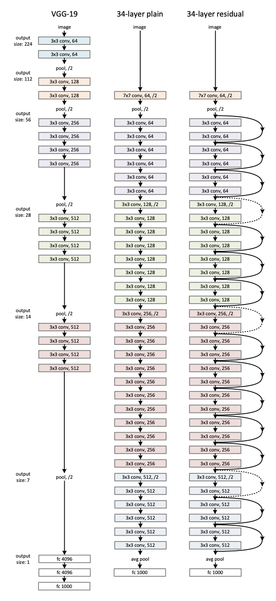

# Implementation of ResNet in tensorflow 2

My implementation for paper [Deep Residual Learning for Image Recognition](https://arxiv.org/abs/1512.03385), using [tensorflow 2](https://www.tensorflow.org/)



> ResNet model architecture (figure from the paper)

## Pre-requirement

Install dependence package with pip:

```
pip install -r requirements.txt
```

## Setup dataset folder

This library use `image_dataset_from_directory` API from Tensorflow 2.0 to load images. You can read more about this API [here](https://www.tensorflow.org/api_docs/python/tf/keras/preprocessing/image_dataset_from_directory)

Dataset directory structure:

```
main_directory/
...class_a/
......a_image_1.jpg
......a_image_2.jpg
...class_b/
......b_image_1.jpg
......b_image_2.jpg
```

## Training

I create `train.py` for training model.

```
usage: train.py [-h] [--model MODEL] [--classes CLASSES] [--lr LR] [--batch-size BATCH_SIZE] [--epochs EPOCHS] [--image-size IMAGE_SIZE] [--image-channels IMAGE_CHANNELS]
                [--train-folder TRAIN_FOLDER] [--valid-folder VALID_FOLDER] [--model-folder MODEL_FOLDER]

optional arguments:
  -h, --help            show this help message and exit
  --model MODEL         Type of ResNet model, valid option: resnet18, resnet34, resnet50, resnet101, resnet152
  --classes CLASSES     Number of classes
  --lr LR               Learning rate
  --batch-size BATCH_SIZE
                        Batch size
  --epochs EPOCHS       Number of training epoch
  --image-size IMAGE_SIZE
                        Size of input image
  --image-channels IMAGE_CHANNELS
                        Number channel of input image
  --train-folder TRAIN_FOLDER
                        Where training data is located
  --valid-folder VALID_FOLDER
                        Where validation data is located
  --model-folder MODEL_FOLDER
                        Folder to save trained model
```

An example command for training:

```
python train.py --model resnet18 --epochs 10 --num-classes 2
```

After training successfully, your model will be saved to `model-folder`, default is `./output`

## Prediction

After your model is trained successfully, you can test your model with `predict.py` script:

```
python predict.py --test-image ./test.png --image-size=28
```
